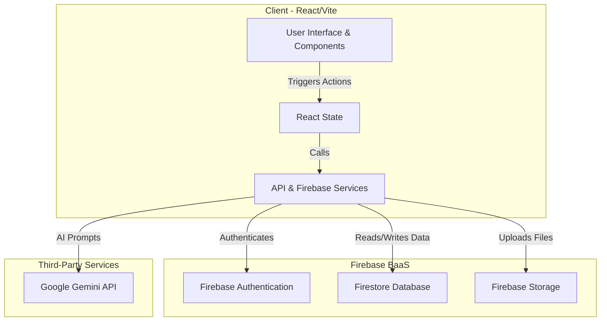

# Architecture Documentation

## High-Level Architecture Diagram
The architecture is structured around a React frontend integrated directly with a Firebase BaaS backend and Google GenAI for LLM features.

---

## Components

### 1. Frontend
- **Framework**: React 19 + TypeScript, bundled with Vite.
- **Styling**: Tailwind CSS for responsive and modern UI elements.
- **Routing**: Internal state-based layout caching and component mounting (`App.tsx`).
- **State Management**: React Context / Hooks (`useState`, `useEffect`).
- **Icons & Charts**: `lucide-react` for iconography, `recharts` for internal analytics dashboards.

### 2. Backend
The application relies solely on **Firebase** for backend capabilities, eliminating the need for a custom Node.js/Python server.
- **Data Structure**: NoSQL implementation utilizing collections and documents.
- **Real-time Sync**: Uses Firestore's `onSnapshot` for live updates to user profiles, project statuses, and audit registries.

### 3. Database
- **Provider**: Firebase Firestore.
- **Key Collections**:
  - `users`: Stores user profiles, roles (`admin`, `team_member`), and basic tracking metadata.
  - `projects`: Contains multi-stage prosthetic workflow details, assigned employee IDs, patient data, and status markers.
- **Features**: Persistent local cache enabled ensuring the application remains functional even in low-bandwidth or offline scenarios until connection is restored.

### 4. Third-Party Services
- **Google GenAI (Gemini)**: Provides AI insights, documentation generation, and complex qualitative analysis via `@google/genai`.

---

## Flows

### Data Flow Explanation
1. **User Interaction**: User engages with a React component (e.g., adding a new project or modifying user details in `Dashboard` or `Projects` pages).
2. **Local State Update**: React handles immediate UI feedback.
3. **Database Write**: A request is fired to Firestore to `setDoc` or `updateDoc`.
4. **Real-time Read**: Listeners in `App.tsx` utilizing `onSnapshot` detect the change in Firestore and broadcast the updated dataset back to the React component.
5. **AI Interaction**: The `geminiService.ts` formulates a system prompt using existing local data and queries the Gemini API. The response is parsed and passed to the UI layer.

### Auth Flow Explanation
1. **Login Event**: User inputs credentials or utilizes OAuth in the `Login.tsx` component.
2. **Verification**: The request is routed to Firebase Authentication. 
3. **Session Genesis**: Upon success, a JWT session is instantiated.
4. **Profile Access & RBAC**: The `onAuthStateChanged` listener in `App.tsx` intercepts the successful login:
   - Fetches the user's role from the Firestore `users` collection.
   - If the user's email includes 'admin', privileges are conditionally escalated to the `admin` role.
   - Grants block-level render access based on Role-Based Access Control logic (e.g., locking out non-admins from the `Analytics` and `WorkflowManagement` tabs).

### AI Integration Explanation
Integrated via the `@google/genai` library implementation inside the frontend. 
- **Methodology**: The environment variable (`GEMINI_API_KEY`) is injected during build time or run locally via `.env.local`. Client requests package contextual application data as text prompts and queries the Gemini API.
- **Purpose**: Used for enhancing text, providing dynamic prosthetic-workflow analytic evaluations, and improving User Experience.
